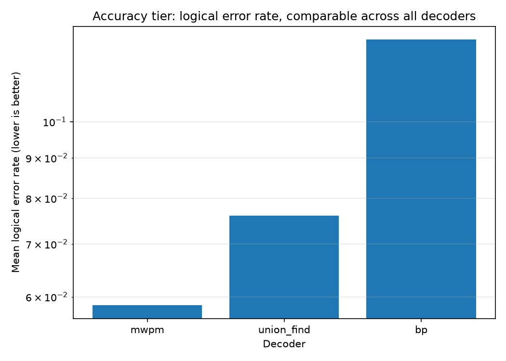
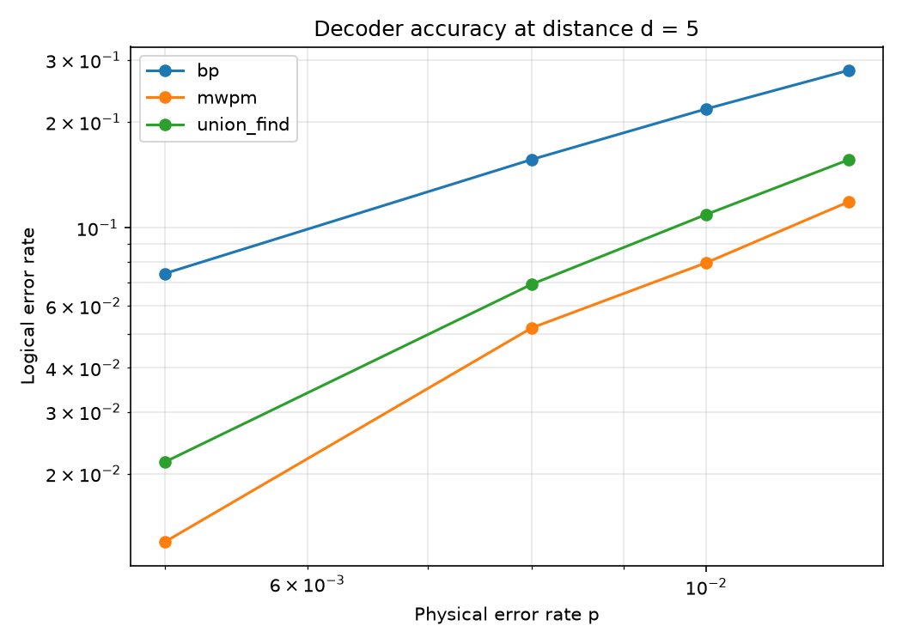
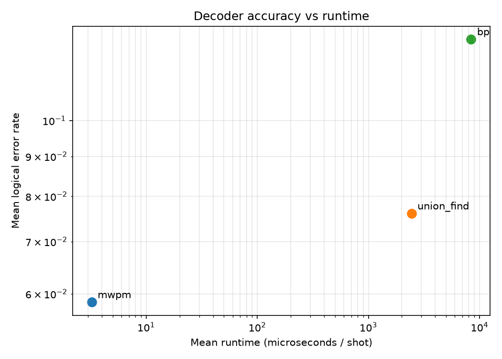

# Decoder Benchmark

A framework for benchmarking surface-code decoders on a level playing field. Given the same
batch of error syndromes, it scores each decoder on **accuracy** (logical error rate), **runtime**
(microseconds per shot) and **memory** (peak allocation), then ranks them on a leaderboard and a
Pareto frontier.

Think of it as trade-surveillance for quantum errors: many candidate models compete to infer the
most likely underlying event (here, the logical error) from a stream of signals (here, syndromes),
and we measure which model wins under a latency and accuracy budget.

This is repo 2 of a ten-part [QEC research portfolio](https://github.com/afogelis/qec-portfolio) and builds on
[`surface-code-simulator`](https://github.com/afogelis/surface-code-simulator).

## Accuracy and runtime are reported as two separate tiers

A fair benchmark must not confuse *algorithm quality* with *implementation language*. This repo
reports two tiers:

- **Accuracy tier (the scientific result):** logical error rate, directly comparable across every
  decoder because they all decode the same syndrome batch.
- **Runtime tier (an engineering note):** speed and memory, compared *only within a backend*. A
  from-scratch Python decoder will always lose on wall-clock to a compiled C++ library regardless
  of its algorithm, so cross-language runtime is not a meaningful comparison and is never presented
  as one.

## Results at a glance



*Accuracy tier. Logical error rate per decoder, comparable across all because they decode identical syndromes. Plain belief propagation is the least accurate; matching is the reference.*



*Logical error rate versus physical error rate at distance 5.*



*Runtime tier, grouped by backend. The horizontal axis compares only within a backend; the vertical (accuracy) axis is comparable across all. The pure-Python decoders are slower than compiled C++ by construction, which is a statement about the language, not the algorithm.*

## Decoders

| Decoder | Backend | Notes |
|---------|---------|-------|
| `mwpm` | compiled C++ ([PyMatching](https://pymatching.readthedocs.io/)) | Minimum-weight perfect matching; community-standard accuracy reference. |
| `bposd` | compiled C++ ([`ldpc`](https://github.com/quantumgizmos/ldpc), optional) | Belief propagation + ordered-statistics decoding; the BP variant that is actually competitive. Installed via the `optimized` extra. |
| `union_find` | pure Python (this repo) | Delfosse-Nickerson cluster growth + spanning-forest peeling on the matching graph. Near-linear time, written for clarity not speed. |
| `bp` | pure Python (this repo) | Log-domain sum-product belief propagation on the detector error model, *without* OSD, to show plain BP's accuracy limit. |

The union-find and belief-propagation decoders are implemented directly (no compiled decoder
libraries) so the benchmark can expose *why* each algorithm wins or loses, not just call a black
box. They are deliberately pedagogical: the scientific claim about them is about **accuracy**, not
speed. The optional `bposd` decoder uses the optimized `ldpc` package as a fair, compiled BP-OSD
reference so that "BP is bad on the surface code" is not mistaken for "this repo's BP is bad" --
plain BP is dominated, but BP-OSD is competitive.

## What this demonstrates

- **Algorithms:** a correct, self-contained union-find decoder (disjoint-set growth + peeling) and a log-domain BP decoder.
- **Benchmarking discipline:** shared syndrome batches, a clean accuracy/runtime tier split that does not conflate algorithm quality with implementation language, accuracy/runtime/memory profiling, and an optimized BP-OSD reference for a fair comparison.
- **A real research finding:** *plain* BP is dominated on surface codes by matching because of graph degeneracy and short cycles; adding ordered-statistics post-processing (BP-OSD, the `bposd` decoder) recovers competitive accuracy. This reproduces the consensus in the decoder literature.

## Install

```bash
pip install -e ".[dev]"   # also installs surface-code-simulator from GitHub
```

For local development against a checked-out simulator, install both editable into one environment:

```bash
pip install -e ../surface-code-simulator
pip install -e . --no-deps
```

## Quick start

```bash
pytest
python examples/run_benchmark.py     # writes outputs/{benchmark.json,accuracy_tier.png,pareto.png,accuracy_vs_p_d5.png}
```

To include the optimized BP-OSD reference decoder (where `ldpc` has a wheel, i.e. Python <= 3.13):

```bash
pip install -e ".[optimized]"
decbench run --decoders mwpm,bposd,union_find,bp --distances 3,5 --p 0.005,0.01 --shots 5000 --output outputs/run.json
```

Benchmark a qLDPC export from [`qldpc-builder`](https://github.com/afogelis/qldpc-builder):

```bash
qldpc export bb72 --output artifacts/bb72 --stim
python examples/run_qldpc_export.py ../qldpc-builder/artifacts/bb72
```

## Example leaderboard

A representative run (distances 3 and 5; p in {0.005, 0.008, 0.01, 0.012}). The **accuracy tier**
ranks every decoder on the same footing:

```
ACCURACY TIER (lower is better; comparable across all decoders)
decoder            mean LER   points  backend
mwpm             5.8550e-02        8  compiled (PyMatching, C++)
union_find       7.6050e-02        8  pure Python (educational)
bp               1.2712e-01        8  pure Python (educational)
```

The **runtime tier** is reported separately and only compared within a backend, because comparing
a pure-Python loop to compiled C++ measures the language rather than the algorithm. The scientific
finding is the accuracy ordering above: plain BP is dominated, while matching and union-find are
close on accuracy. Adding the optional `bposd` (BP-OSD) decoder closes BP's accuracy gap.

## Library usage

```python
from decbench import (
    BenchmarkConfig, run_benchmark, build_leaderboard,
    format_accuracy_tier, format_runtime_tier,
)

result = run_benchmark(BenchmarkConfig(
    decoders=["mwpm", "union_find", "bp"],
    distances=[3, 5], error_rates=[0.005, 0.01], shots=5_000, seed=2026,
))
rows = build_leaderboard(result)
print(format_accuracy_tier(rows))   # comparable across all decoders
print(format_runtime_tier(rows))    # grouped by backend
```

### Adding your own decoder

Implement the `Decoder` protocol (`fit(circuit)` + `decode_batch(detection_events)`) and register it:

```python
from decbench import register_decoder
register_decoder("my_decoder", MyDecoder)
```

The companion `ml-qec-decoder` repo registers machine-learning decoders this way.

## Layout

- `src/decbench/decoders/` — `mwpm`, `union_find`, `bp`, and optional `bposd` (BP-OSD via `ldpc`)
- `src/decbench/dem_matrices.py` — detector error model to parity-check matrices
- `src/decbench/{runner,leaderboard,viz,base,registry}.py` — framework
- `tests/` — correctness tests on the real Stim/PyMatching stack
- `examples/` — runnable benchmark

## License

MIT — see [LICENSE](LICENSE).
